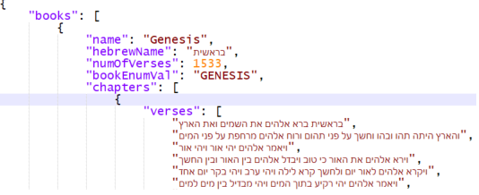

# json-hebrew-bible
A convenient JSON bible

Contains both simple text and text with diacritics (Niqud and Teamim).

The JSON file is stuctured by:
1. books
   - name
   - Hebrew name
   - total number of verses
   - book enum value (you may map it to an enum structure in your favorite programming language)
3. chapters
4. verses
   - simple text
   - with diacritics

